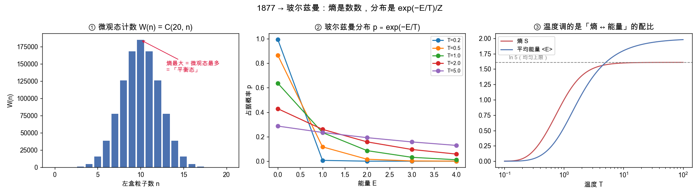
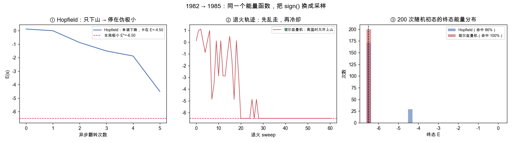
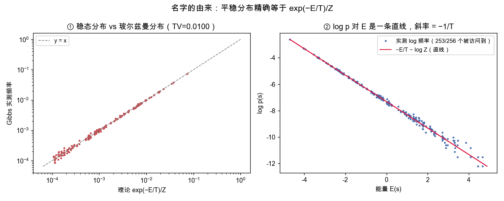
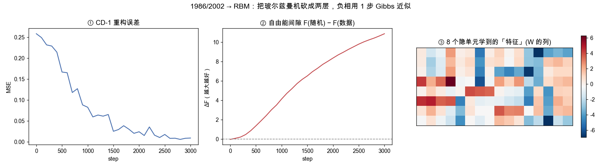
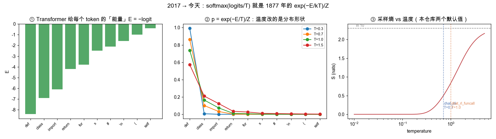

# 从 S = k log W 到 `gpt.py:145` 的一条线

> 玻尔兹曼其人、"玻尔兹曼机"这个名字从何而来、"受限"到底限了什么、辛顿的三篇论文，
> 以及为什么本仓库 `codechat/gpt.py` 第 145 行那个 `F.softmax(logits, dim=-1)`
> 就是 1877 年那个 `exp(−E/kT)/Z`。
>
> 全文只讲**一条线**。这条线有一个起点（一个奥地利人为原子的存在辩护了三十年，
> 然后在他被证明是对的两年前自杀）、两次断裂（1969、1995）、
> 一次诺贝尔物理学奖（2024），和一个终点（你正在训练的这个 8B 模型的最后一层）。
>
> 配套可执行 demo：`docs/examples/boltzmann_machine_demo.py`
> （`python docs/examples/boltzmann_machine_demo.py` 复现本文全部数字和四张图）。

---

## 目录

- [0. 这条线的骨架](#0-这条线的骨架)
- [1. 路德维希·玻尔兹曼（1844–1906）](#1-路德维希玻尔兹曼18441906)
- [2. 那个公式的技术内容：熵是数数，分布是 exp(−E/T)/Z](#2-那个公式的技术内容熵是数数分布是-expetz)
- [3. 断裂与接续：神经网络的另一半渊源（1943–1982）](#3-断裂与接续神经网络的另一半渊源19431982)
- [4. 1982 Hopfield：把 Ising 模型搬进神经网络](#4-1982-hopfield把-ising-模型搬进神经网络)
- [5. 1983–1985 辛顿：玻尔兹曼机](#5-19831985-辛顿玻尔兹曼机)
- [6. 为什么玻尔兹曼机当年跑不动：Z 的诅咒](#6-为什么玻尔兹曼机当年跑不动z-的诅咒)
- [7. 2002 CD-1 与 2006 DBN：这条线第二次接上](#7-2002-cd-1-与-2006-dbn这条线第二次接上)
- [8. 今天：本仓库里的玻尔兹曼](#8-今天本仓库里的玻尔兹曼)
- [9. 类比在哪里断掉](#9-类比在哪里断掉)
- [10. 一张对照表](#10-一张对照表)
- [11. 运行 demo](#11-运行-demo)

---

## 0. 这条线的骨架

先把结论放在最前面。下面每一行都是上一行的**直接后果**，中间没有跳跃：

| 年份 | 谁 | 干了什么 | 一行公式 |
|---|---|---|---|
| 1877 | Boltzmann | 熵 = 微观态数的对数 | `S = k log W` |
| 1877 | Boltzmann | 平衡态下状态的概率由能量决定 | `p(s) = exp(−E(s)/kT) / Z` |
| 1925 | Ising / Lenz | 把 `E` 写成自旋的两两耦合 | `E = −½ Σ J_ij s_i s_j` |
| 1982 | Hopfield | 把 `J` 换成**可学的权重** `W`，得到联想记忆 | `E(s) = −½ sᵀWs`，`s_i ← sign(h_i)` |
| 1985 | Hinton & Sejnowski | 把 `sign()` 换成**按玻尔兹曼分布采样** | `p(s_i=1) = σ(2h_i/T)` |
| 1985 | Ackley/Hinton/Sejnowski | 学习律 = 数据下的相关 − 模型下的相关 | `Δw_ij ∝ ⟨s_i s_j⟩_data − ⟨s_i s_j⟩_model` |
| 1986 | Smolensky | 砍成二部图 → 条件独立 + 自由能有闭式 | `E(v,h) = −vᵀWh − bᵀv − cᵀh` |
| 2002 | Hinton | 负相用 1 步 Gibbs 近似，RBM 终于训得动 | `CD-1` |
| 2006 | Hinton et al. | 逐层 RBM 预训练 → 深度网络能收敛 | `DBN` |
| 2017 | Vaswani et al. | 把 `Z` 从 `2^N` 项换成 `50257` 项的显式求和 | `softmax(logits)` |
| 今天 | 本仓库 | `codechat/gpt.py:141-146` | `p = softmax(logits / T)` |

**整条线只有一个母题：给状态定义能量，然后按 `exp(−E/T)` 分配概率。**
一百五十年里变的只是「谁来算 `Z`」。

---

## 1. 路德维希·玻尔兹曼（1844–1906）

路德维希·爱德华·玻尔兹曼 1844 年 2 月 20 日生于维也纳。他后来讲过一个不太得体的玩笑：
自己出生在忏悔星期二的夜里，第二天就是圣灰星期三——狂欢和斋戒之间那道缝里；
他说这解释了为什么他的情绪总在狂喜和绝望之间摆荡，从不肯在中间停留。
当时朋友们把它当笑话听。

他的父亲是税务官，1859 年死于肺结核，玻尔兹曼那年十五岁。他在维也纳大学师从约瑟夫·斯特凡，
1866 年获博士学位，1869 年二十五岁就当上格拉茨大学的理论物理教授。
1884 年他从热力学和麦克斯韦电磁理论出发推导出黑体辐射的 `T⁴` 定律——
那条定律上因此有斯特凡和他两个人的名字。

### 1.1 他做的事：把力学和概率焊在一起

十九世纪下半叶的核心矛盾是这样的：牛顿力学在时间上是可逆的，把所有分子的速度反号，
一切都会精确地倒着重演一遍。可现实不是这样——热只从热的地方流向冷的地方，
杯子摔碎了不会自己拼回去。**可逆的微观规律，怎么会导出不可逆的宏观定律？**

1872 年玻尔兹曼写下了后来以他命名的输运方程，并证明其中一个量（他记作 `H`）只会单调下降。
这就是 **H 定理**，而 `−H` 就是熵。他认为自己证明了热力学第二定律。

1876 年，他在格拉茨的同事约瑟夫·洛施密特提出了反驳，后世称为**可逆性佯谬**（Umkehreinwand）：

> 你的推导用的全是可逆的力学。可逆的前提不可能推出不可逆的结论。
> 把所有分子的速度反号，你的 `H` 就必须往上走。你的定理里一定藏着一个非力学的假设。

洛施密特是对的。玻尔兹曼花了一年才给出回答——**而这个回答比原来的定理重要得多。**

### 1.2 1877：答案是「数数」

他的回答是：**第二定律根本不是一条力学定律，它是一条关于数数的定律。**

给定一个宏观态（比如「气体均匀充满容器」），有多少个微观态与之相容？
玻尔兹曼把这个数叫作**排列数**（Permutabilität），记作 `W`。
均匀分布对应的 `W` 大得离谱，所有分子挤在左半边对应的 `W` 小得可怜。
系统并不是被某种力"推"向平衡，它只是**走向了微观态更多的那一边**——因为那一边的态实在太多。

于是有了 1877 年那篇《论热力学第二定律与概率计算的关系》里的核心命题：

```
S ∝ log W
```

这一步同时也回答了洛施密特：反转速度确实会让熵下降，
**但那个初态在 `W` 里占的比例小到你等宇宙年龄也撞不上一次**。
第二定律为真，不是因为它不可能被违反，而是因为违反它的概率是 `10⁻¹⁰²³` 这个量级的东西。

**他把"必然"换成了"几乎必然"。** 这一步让他付出了后半生的代价。

1896 年策梅洛拿庞加莱的回归定理又质疑了一次（**回归佯谬**，Wiederkehreinwand）：
任何有限系统迟早会回到初态附近，所以熵不可能单调增。
玻尔兹曼的回答还是同一句：会回来，但你要等的时间比宇宙的年龄长得多。

### 1.3 他打的那场仗

1890 年代的欧洲物理学界流行两样东西，两样都跟他过不去。

一样是奥斯特瓦尔德的**唯能论**：能量是唯一实在的东西，原子是多余的假设。
另一样是马赫的实证主义：**看不见的东西不该写进物理学**——原子谁看见过？
所以原子是形而上学。

1895 年在吕贝克的自然科学家大会上，玻尔兹曼和奥斯特瓦尔德当面辩论。
索末菲后来把那场辩论形容为斗牛：奥斯特瓦尔德是斗牛士，玻尔兹曼是那头公牛。
公牛赢了那一场，但输掉了那些年的气氛。

他不停地换学校——格拉茨、维也纳、慕尼黑、维也纳、莱比锡、维也纳。
在莱比锡他和奥斯特瓦尔德成了同事，两人私交其实不坏，这让局面更难受；
他在那里有过一次未遂的自杀。1889 年他十一岁的长子路德维希·胡戈死于阑尾炎，
他一直认为是自己耽误了治疗。

1902 年他回到维也纳，除物理外还接下了马赫留下的自然哲学课——
一个坚持原子论的人去讲马赫的哲学课，讽刺意味他自己很清楚。
讲座大到要换教室，皇帝接见了他。他在讲台上说过一句被反复引用的话：

> 我是一个孤独的人，一个留在后面的人。

1905 年他去加州大学伯克利分校讲暑期课，回来写了篇游记
《一个德国教授的黄金国之旅》，在里面抱怨美国人不喝酒只喝水，
说这是此行最大的苦难。那是他写过最轻松的文字。

1906 年 9 月 5 日，在的里雅斯特附近的杜伊诺，妻子和女儿去海里游泳的时候，
玻尔兹曼在旅馆房间里上吊自杀，六十二岁。

### 1.4 他没看见的后来

- **1905 年**爱因斯坦解释了布朗运动——原子存在的直接证据。那是他死前一年印出来的。
- **1908–1909 年**佩兰完成实验，原子的存在再无争议。那是他死后两三年。
- **普朗克**在 1900 年为解释黑体辐射被迫用了玻尔兹曼的方法，
  引入一个常数 `k`（他称之为**玻尔兹曼常数**，尽管这个常数是普朗克自己先写下来的），
  并把玻尔兹曼的关系式写成了最终形式：

  ```
  S = k log W
  ```

  **玻尔兹曼本人从未把它写成过这个样子。**
  维也纳中央公墓他的墓碑上刻的，是普朗克的写法。

一个人用一生证明「概率就够了」，而他自己的名字，最后是被别人以概率的方式安放上去的。


## 2. 那个公式的技术内容：熵是数数，分布是 exp(−E/T)/Z

生平到此为止。下面把 1877 年那两个命题变成能跑的代码。

### 2.1 `S = k log W`：第二定律是一句数数的结论

`docs/examples/boltzmann_machine_demo.py` 第 1 部分把 20 个粒子扔进左右两个盒子，
宏观态是「左边有 n 个」，微观态数就是 `C(20, n)`：

```
   n    W(n)=C(N,n)    S=ln W
   0              1     0.000
   4          4,845     8.486  ############################
   8        125,970    11.744  #######################################
  10        184,755    12.127  ########################################   ← 最大
  12        125,970    11.744  #######################################
  20              1     0.000

  全部在左边（'有序'）的概率：9.537e-07
  正好均分（'平衡'）的概率  ：1.762e-01
  倍数：184,756 倍
```

20 个粒子，"有序"就已经比"平衡"少了 18 万倍。
把 20 换成阿伏伽德罗常数，这个比值的指数是 `10²³` 量级。
**洛施密特的反转确实存在，只是它落在一个测度为零的集合里。**

对应的图（`docs/images/boltzmann_01_entropy_and_distribution.png` 左）：



### 2.2 `p ∝ exp(−E/kT)`：分布是「熵与能量的一次配比」

在总能量固定的约束下最大化熵，用一个拉格朗日乘子（那个乘子就是 `1/kT`），
直接得到玻尔兹曼分布：

```
p_i = exp(−E_i / kT) / Z,      Z = Σ_j exp(−E_j / kT)
```

等价地：系统最小化**自由能** `F = ⟨E⟩ − T·S`。
`T` 就是这场拉锯的汇率——它决定你愿意为多一点熵付出多少能量。

demo 里对同一组能级扫温度：

```
      T | E=0   E=1   E=2   E=3   E=4   |   S = −Σ p·ln p
    0.2 | 0.993 0.007 0.000 0.000 0.000 |   0.0407
    1.0 | 0.636 0.234 0.086 0.032 0.012 |   1.0000
    5.0 | 0.287 0.235 0.192 0.157 0.129 |   1.5705
  100.0 | 0.204 0.202 0.200 0.198 0.196 |   1.6093   ← ln 5 = 1.6094
```

注意 demo 里那行代码：

```python
p = F.softmax(-E / T, dim=0)          # ← softmax(-E/T) 就是玻尔兹曼分布
```

**`softmax` 不是「像」玻尔兹曼分布，它就是。**
这一行是全文的枢纽，第 8 节会回到它。

### 2.3 `Z` 是这条线上唯一真正的障碍

`Z = Σ_j exp(−E_j/kT)` 要对**所有**状态求和。
5 个能级时它是 5 项。`N` 个二值神经元时它是 `2^N` 项。
`N = 100` 就已经超过可观测宇宙的原子数了。

**这条线上后面所有的技术（Gibbs 采样、模拟退火、对比散度、乃至 Transformer 的胜出），
全部是在处理同一件事：`Z` 算不动。** 记住这句话。

---

## 3. 断裂与接续：神经网络的另一半渊源（1943–1982）

玻尔兹曼这条线在物理学内部继续走：

- **1925** 伊辛（在楞次的建议下）研究一维自旋链，能量 `E = −J Σ s_i s_{i+1}`，
  发现一维没有相变，一度以为模型没用。
- **1944** 昂萨格给出二维伊辛模型的精确解，有相变。伊辛模型成为统计物理的标准玩具。
- **1975** 谢林顿-柯克帕特里克、爱德华兹-安德森提出**自旋玻璃**：
  耦合 `J_ij` 随机、有正有负 → 能量地形上有**指数多个局部极小**。
  这个"崎岖能量地形"的图像，后来直接变成了神经网络的损失地形语言。

同时，另一条完全独立的线在生物学和心理学里走：

- **1943** 麦卡洛克与皮茨：神经元 = 阈值逻辑单元。第一个"人工神经元"。
- **1949** 赫布：「一起放电的细胞连在一起」（*cells that fire together wire together*）。
  这是**第一条学习律**，而且它是**局部的**——只用到突触两端的活动。
- **1958** 罗森布拉特的感知机。硬件、新闻发布会、以及过度承诺。
- **1969** 明斯基与佩珀特的《感知机》：单层感知机连 XOR 都学不了。
  **第一次寒冬开始。** 神经网络研究在美国基本停摆十几年。

到 1980 年为止，这两条线互不相识：
物理学有能量地形但没有学习，心理学有学习律但没有全局的数学。

**1982 年，一个物理学家把它们接上了。**

---

## 4. 1982 Hopfield：把 Ising 模型搬进神经网络

约翰·霍普菲尔德的 1982 年 PNAS 论文
《Neural networks and physical systems with emergent collective computational abilities》
做了一件在今天看来极简单的事：

**把伊辛模型的耦合常数 `J_ij` 换成「可以被写入」的权重 `W_ij`。**

```python
# docs/examples/boltzmann_machine_demo.py

def hebb_weights(P):
    """Hebb 规则：W = (1/N) Σ_μ ξ^μ (ξ^μ)ᵀ，对角清零。"""
    W = (P.t() @ P) / P.shape[1]
    W.fill_diagonal_(0.0)
    return W

def energy(s, W):
    """E(s) = -½ sᵀWs —— 就是 Ising 模型的能量。"""
    return -0.5 * (s @ W @ s)

def hopfield_settle(s, W):
    """s_i ← sign(Σ_j W_ij s_j)。能量单调不增 → 必收敛。"""
    for i in torch.randperm(s.numel()):
        s[i] = 1.0 if W[i] @ s >= 0 else -1.0
    ...
```

三行观察构成了那篇论文的全部：

1. 如果 `W` 对称且对角为零，异步更新 `s_i ← sign(h_i)` 让 `E` **单调不增**。
2. 状态空间有限 + 能量单调不增 → **必然收敛到某个局部极小**。
3. 用 Hebb 外积写入的模式，恰好就是能量的极小点 → **网络成了联想记忆**：
   给一个残缺的输入，它自己滚到最近的那个记忆上。

demo 存了 3 个 16 位模式，穷举 `2^16 = 65536` 个态验证：

```
存了 3 个 16 位模式（Hebb 外积），它们的能量：
  模式 0: E = -6.5000
  模式 1: E = -6.5000
  模式 2: E = -6.5000

穷举 2^16 = 65536 个状态：全局最低能量 E* = -6.5000，共 6 个态达到它
  能量分布：min=-6.500  median=0.125  max=1.500
```

（6 个 = 3 个模式 + 3 个反相模式。`E(s) = E(−s)` 是这个能量函数的固有对称性。）

**这台机器的致命缺点也在同一句话里：它只会下山。**
自旋玻璃告诉我们能量地形上有指数多个局部极小，其中大部分是**伪记忆**——
存储的模式的线性组合，网络会一头栽进去出不来。

demo 里从 200 个随机初态出发跑确定性 Hopfield：

```
  更新规则              命中全局极小   平均终态能量
  Hopfield（确定性）          85.5%       -6.2100
```

14.5% 的时候它停在了 `E = −4.5` 这个伪极小上，再也不动。

**这就是辛顿要解决的问题。**

---

## 5. 1983–1985 辛顿：玻尔兹曼机

### 5.1 人

杰弗里·辛顿在剑桥念的是实验心理学，1978 年在爱丁堡拿的 AI 博士
（导师是克里斯托弗·朗盖-希金斯，一个从理论化学转行做认知科学的人）。
他是乔治·布尔的玄孙——**布尔代数和玻尔兹曼机之间隔着五代人**，
这条家谱线本身就够写一篇了。

1980 年代初他在加州大学圣迭戈分校和卡内基梅隆，和特里·塞诺夫斯基（一个物理学出身的神经科学家）合作。

### 5.2 那一步改动

1983 年，辛顿和塞诺夫斯基在 CVPR 上发表
《Optimal Perceptual Inference》。**"玻尔兹曼机"这个名字第一次出现。**
1985 年，阿克利、辛顿、塞诺夫斯基在 *Cognitive Science* 上发表
《A Learning Algorithm for Boltzmann Machines》——这是那篇被引用了几万次的论文。

改动只有一行：

```
Hopfield  (1982):  s_i ← sign(h_i)                    确定性，只能下山
玻尔兹曼机 (1985):  s_i ← +1 以概率 σ(2·h_i / T)         随机，允许上山
```

为什么是 `σ(2h_i/T)`？因为翻转 `s_i` 造成的能量差是 `ΔE = 2 s_i h_i`，
按玻尔兹曼分布，`p(s_i=+1)/p(s_i=−1) = exp(2h_i/T)`，
整理一下就是 sigmoid。**这不是启发式，这是 `exp(−E/T)/Z` 在单个自旋上的精确条件分布。**

也就是说：**这个网络不再是「找一个低能量状态」，它是在按玻尔兹曼分布采样。**
它的稳态是一个概率分布，不是一个点。

再配上柯克帕特里克 1983 年在 *Science* 上刚发表的**模拟退火**——
`T` 从高到低降——就得到了 demo 里的：

```python
def boltzmann_settle(s, W, T_hi=2.0, T_lo=0.05, sweeps=60):
    for k in range(sweeps):
        T = T_hi * (T_lo / T_hi) ** (k / (sweeps - 1))   # 几何退火
        for i in torch.randperm(s.numel()):
            p_up = torch.sigmoid(2.0 * (W[i] @ s) / T)
            s[i] = 1.0 if torch.rand(()) < p_up else -1.0
```

同样 200 个随机初态，同一个 `W`，同一个 `E`：

```
  更新规则              命中全局极小   平均终态能量
  Hopfield（确定性）          85.5%       -6.2100
  玻尔兹曼机（退火）         100.0%       -6.5000
```



左图：Hopfield 单调下降，卡在 `E = −4.50`，再也出不来。
中图：玻尔兹曼机高温时到处乱撞（能量一度升到 `+1`），冷却后落到 `−6.50`。
右图：200 次的终态分布，蓝色那一小堆就是 Hopfield 的伪记忆。

> **随机性不是噪声，是搜索工具。**
> 这是玻尔兹曼那句「概率就够了」在 1985 年的回声。

### 5.3 第二步改动：隐单元

Hopfield 网络的所有单元都是可见的。玻尔兹曼机把单元分成**可见层 `v`** 和**隐层 `h`**。
隐单元不对应任何数据，它们的作用是**表示可见变量之间的高阶相关**——
这正是明斯基-佩珀特 1969 年指出感知机做不到的那件事。

于是模型定义的是一个边缘分布：

```
p(v) = Σ_h exp(−E(v,h)) / Z
```

### 5.4 第三步，也是最漂亮的一步：学习律

要让 `p(v)` 贴近数据分布，最小化 KL 散度，对 `w_ij` 求导，结果是：

```
Δw_ij  ∝  ⟨s_i s_j⟩_data  −  ⟨s_i s_j⟩_model
           ────────────      ─────────────
             正相（clamped）    负相（free-running）
```

这条式子有三个性质，任何一个单独拿出来都值得写篇论文：

1. **它是精确梯度**，不是近似。KL 散度对权重的导数就长这样。
2. **它完全是局部的**。更新 `w_ij` 只需要神经元 `i` 和 `j` 各自的活动的相关，
   不需要误差从输出层反向传播回来。这在 1985 年是巨大的卖点——
   **它在生物学上是可实现的**，而反向传播不是。
3. **它有一个认知学的解释**，辛顿他们自己用过：
   正相是"清醒时看数据"，负相是"做梦时自由运行"。学习 = 让梦境贴近现实。
   （后来 Crick & Mitchison 1983 的"反向学习"睡眠假说和这个撞了个正着。）

### 5.5 为什么叫「玻尔兹曼机」

这是本文最该讲清楚的一个问题，而它常被草草带过成一句"因为受了统计物理的启发"。
**不是启发。这个名字是一句可以被测量、可以被证伪的断言。**

#### (1) 字面意思：这台机器的平稳分布**就是**玻尔兹曼分布

Hopfield 网络运行到底会**停在一个状态**上——它的输出是一个点。
玻尔兹曼机运行到底**永远不停**，它在状态空间里一直游走；
有意义的问题不是"它停在哪"，而是"**它待在每个状态上的时间比例是多少**"。

答案是：

```
p(s) = exp(−E(s)/T) / Z
```

这不是设计目标，是数学后果。更新规则 `p(s_i=+1) = σ(2h_i/T)` 恰好是玻尔兹曼分布
在单个自旋上的**精确条件分布**，而 `W` 对称保证了细致平衡，
于是这条 Gibbs 采样链的**唯一平稳分布**就是 `exp(−E/T)/Z`。

demo 第 3b 部分把这句话**测了出来**：8 个单元（`2^8 = 256` 个态可以穷举出真实分布），
对称随机 `W`，定温 `T = 1.0`，跑 20 万个 Gibbs sweep 数访问频率：

```
        状态      E(s)     理论 exp(−E/T)/Z         实测频率       比值
  10100010    -4.699            0.07331      0.07276    0.992
  01011101    -4.699            0.07331      0.07345    1.002
  01010101    -4.030            0.03756      0.03726    0.992
  10101010    -4.030            0.03756      0.03790    1.009
  10101110    -3.954            0.03481      0.03458    0.993
  ...

    KL(理论‖实测)   = 0.00096
    总变差距离 TV   = 0.01003
    log-log 相关系数 = 0.99830
```



右图是最直白的证据：**`log p(s)` 对 `E(s)` 画出来是一条直线，斜率恰好是 `−1/T`。**
一个分布的对数是能量的线性函数——这就是"玻尔兹曼分布"的定义，一字不差。

> **名字是描述，不是致敬。** 叫它"玻尔兹曼机"，和把一个服从高斯分布的过程
> 叫"高斯过程"是同一种命名：说的是它服从哪个分布，不是说它纪念谁。

#### (2) 由此白拿的三条性质

正因为分布**恰好**是 `exp(−E/T)/Z`，下面三件事才成立。换任何别的分布都不成立：

**(a) 能量差 = 对数概率差**

```
log p(s_a) − log p(s_b) = −(E_a − E_b) / T
```

`Z` 在相减时消掉了。这意味着**你不需要知道那个算不动的 `Z`，
就能比较任意两个状态的相对概率**——这是所有基于能量的模型能工作的根基。

**(b) `T → 0` 时它退化成 Hopfield 网络**

温度趋于零，全部概率质量塌到最低能量态，`σ(2h/T) → step(h) = sign()`。
所以严格地说：**Hopfield 网络是玻尔兹曼机在零温下的特例**，
就像贪心解码是 `temperature → 0` 的采样。1982 和 1985 不是两个模型，是同一个模型的两个温度。

**(c) 那条学习律是名字的直接后果**

这是最深的一层理由。为什么梯度恰好是"两个相关之差"这么干净的形式？
把式子写出来就看见了。能量对权重是**线性**的：

```
E(s) = −½ Σ_ij w_ij s_i s_j    ⟹    ∂E/∂w_ij = −s_i s_j
```

而对数概率是能量的**线性函数减去 log Z**：

```
log p(v) = log Σ_h exp(−E(v,h))  −  log Z
                                     ↑ 这一项包含了所有状态

∂ log p(v) / ∂w_ij =  −⟨∂E/∂w_ij⟩_{h|v}  +  ⟨∂E/∂w_ij⟩_{v,h 自由}
                   =   ⟨s_i s_j⟩_data    −   ⟨s_i s_j⟩_model
                        ↑ 来自 log Σ_h        ↑ 来自 log Z
```

**正相来自第一项，负相来自 `log Z`。** 那个折磨了这条线一百年的配分函数，
在求导之后变成了一个可以采样估计的期望——这是 `Z` 唯一一次不是纯粹的障碍。

> 一句话总结：**因为概率是能量的指数，而能量是权重的线性函数，
> 所以梯度必然是两个相关的差。** 这条学习律之所以那么漂亮、那么局部、
> 那么符合赫布 1949 年的直觉，全部来自"玻尔兹曼"这三个字。
> 换一个非指数族的分布，梯度里就会冒出雅可比行列式之类的东西，
> 局部性立刻消失，1985 年那篇论文也就不存在了。

#### (3) 名字是谁起的

"Boltzmann machine" 这个词由辛顿和塞诺夫斯基在 1983 年 CVPR 那篇
《Optimal Perceptual Inference》中首次使用，1985 年
《A Learning Algorithm for Boltzmann Machines》把它固定下来。

值得一提的是，这个名字在当时还有一层对照意味：
同期还有 "Harmony theory"（斯莫伦斯基）、"Hopfield net"、"Cauchy machine"
（把玻尔兹曼分布换成柯西分布以加快退火）这些名字并存。
**"某某机"这个后缀在 1980 年代特指"以某个分布为平稳分布的随机网络"**，
所以"柯西机"和"玻尔兹曼机"的区别就是柯西分布和玻尔兹曼分布的区别——
这也从侧面说明了这个名字是**技术性的**，不是纪念性的。

---

## 6. 为什么玻尔兹曼机当年跑不动：Z 的诅咒

回到第 2.3 节那句话：**`Z` 算不动。**

- **正相** `⟨s_i s_j⟩_data`：把数据钳在可见层上，跑 Gibbs 到平衡。慢，但还行。
- **负相** `⟨s_i s_j⟩_model`：**让网络完全自由地跑到热平衡**，再统计相关。

第二项是灾难。要从 `2^N` 个状态的玻尔兹曼分布里取无偏样本，
Gibbs 链的混合时间在低温下随 `N` 指数增长。1985 年的机器上，
一个几十个单元的玻尔兹曼机就要跑几天，而且你无法确定它到底混合了没有。

**这就是玻尔兹曼机 1985 年之后沉寂的原因。它数学上完美、生物学上合理、计算上不可行。**

一年之后的 1986 年，鲁梅尔哈特、辛顿、威廉姆斯在 *Nature* 上发表了反向传播。
反传在生物学上讲不通、在数学上"只是链式法则"，但它**快**——
一次前向、一次反向，没有采样，没有平衡，没有 `Z`。

辛顿本人转去做反传了。**这条线第一次断在这里，断了十六年。**

---

## 7. 2002 CD-1 与 2006 DBN：这条线第二次接上

### 7.1 受限玻尔兹曼机（RBM）到底是什么

1986 年斯莫伦斯基在 PDP 那本书里提出了 **Harmonium**，
也就是后来被叫作**受限玻尔兹曼机**（Restricted Boltzmann Machine, RBM）的东西。
它就是一个玻尔兹曼机，只做了一件事：**把图砍成二部图。**

#### (1) 「受限」限的是什么

普通玻尔兹曼机是一张**任意的**无向图，任何两个单元之间都可以有边；
RBM 只允许可见层和隐层之间有边，**层内一条边都没有**：

```
     一般玻尔兹曼机                       受限玻尔兹曼机（RBM）

    h₁ ─────── h₂                       h₁        h₂          ← 隐层内部：无边
     │ ╲     ╱  │                        │ ╲     ╱ │
     │   ╲ ╱    │                        │   ╲ ╱   │
     │   ╱ ╲    │                        │   ╱ ╲   │          ← 层间：全连接
     │ ╱     ╲  │                        │ ╱     ╲ │
    v₁ ─────── v₂                       v₁        v₂          ← 可见层内部：无边
       ↑ 层内也有边
```

对应到能量函数上，「受限」就是**只保留交叉项**：

```
一般玻尔兹曼机:  E(s)   = −½ sᵀWs − bᵀs           （所有两两耦合）
受限玻尔兹曼机:  E(v,h) = −vᵀWh − bᵀv − cᵀh       （只有 v–h 的耦合）
                           ↑ 没有 vᵀUv，也没有 hᵀVh
```

概率还是同一个玻尔兹曼分布：`p(v,h) = exp(−E(v,h)) / Z`。
**RBM 不是一个新模型，它是玻尔兹曼机的一个受约束的特例**——
§5.5 讲的一切（平稳分布、能量差=对数概率差、正相减负相）原封不动地适用。

#### (2) 换来的第一个恒等式：条件独立 → 整层并行采样

因为 `h_j` 之间没有边，给定 `v` 之后每个 `h_j` 只通过 `v` 与外界相连，
于是它们**条件独立**：

```
p(h | v) = Π_j p(h_j | v),      p(h_j = 1 | v) = σ(c_j + (vW)_j)
p(v | h) = Π_i p(v_i | h),      p(v_i = 1 | h) = σ(b_i + (Wh)_i)
```

demo 第 4a 部分在一个 4 可见 / 3 隐的小 RBM 上把 `p(h|v)` 穷举出来，
和「每个隐单元独立 sigmoid 的乘积」逐项对照：

```
  取 v = 1101，逐个 h 对照：
       h      穷举 p(h|v)     Π_j σ(...)          差
     000       0.001287       0.001287   3.38e-09
     110       0.553753       0.553753   5.96e-08
     111       0.323830       0.323830   8.94e-08
     ...
    最大偏差 8.94e-08 —— 严格相等（数值误差量级）。
```

**后果：Gibbs 采样从「逐个单元串行更新 N 次」变成「两次矩阵乘法」。**
一般玻尔兹曼机里翻转 `s_i` 必须先知道所有邻居的当前值，只能一个一个来；
RBM 里 `v → h` 和 `h → v` 各是一次 GEMM，天生适合向量化和 GPU。

#### (3) 换来的第二个恒等式：隐层可以被解析地积掉

因为 `h_j` 之间无耦合，`Σ_h exp(−E(v,h))` 这个 `2^{n_hid}` 项的求和
可以拆成每个 `h_j` 独立求和的**乘积**，于是**自由能有闭式**：

```python
def free_energy(self, v):
    """F(v) = -bᵀv - Σ_j softplus(c_j + (vW)_j)，满足 p(v) = exp(-F(v))/Z。"""
    return -(v @ self.b) - F.softplus(v @ self.W + self.c).sum(1)
```

那个 `softplus`（`log(1 + eˣ)`）就是对单个二值隐单元求和的结果：
`log(e⁰ + e^{c_j + (vW)_j}) = softplus(c_j + (vW)_j)`。

demo 把这个恒等式也验证了一遍（穷举 8 项 vs 解析式）：

```
       v        穷举 Σ_h（8 项）      解析 exp(−F(v))         相对误差
    0000          15.203237          15.203236     6.27e-08
    1100         347.901001         347.901245     7.02e-07
  ... 全部 16 个 v 的最大相对误差：7.02e-07
```

> **一个有意思的观察**：`F(v) = −bᵀv − Σ_j softplus(c_j + (vW)_j)`
> 在结构上就是**一个单隐层 MLP**——线性层、softplus 激活、求和输出。
> 今天到处在用的 `softplus` / `softmax` 这类函数，血缘上都来自
> 「对一个离散隐变量求和」这件事。RBM 的自由能是这条血缘最干净的化石。

**注意 `Z` 仍然算不动**（它要对全部 `2^{n_vis}` 个 `v` 求和）。
但结合 §5.5 的性质 (a)，`Z` 在比较两个 `v` 时会消掉，
所以 `F(v)` 已经足够回答「模型认为哪个数据更可能」——
这正是 demo 里 `ΔF = F(随机) − F(数据)` 这个诊断量的依据。

#### (4) 代价：表达力

天下没有免费的午餐。砍掉层内的边意味着：

| 没了什么 | 后果 |
|---|---|
| `v–v` 横向连接 | 可见单元之间的直接相关只能**绕道隐层**表达；像「这两个像素必须互斥」这类约束要多花隐单元 |
| `h–h` 横向连接 | 隐单元之间不能互相 explain away，学到的特征容易冗余、重复 |

弥补的办法不是把边加回来（那就退回训不动的一般 BM 了），
而是**堆叠**——这直接引出 7.3 节的深度信念网络。

#### (5) 顺带澄清四个容易混的缩写

| 名字 | 是什么 | 关系 |
|---|---|---|
| **BM**（玻尔兹曼机，1985） | 任意无向图 | 表达力最强，负相要跑到热平衡，训不动 |
| **RBM**（受限玻尔兹曼机，1986/2002） | 二部图，单隐层 | BM 的特例；两个恒等式让 CD-1 成为可能 |
| **DBN**（深度信念网络，2006） | 多层堆叠，**除最顶两层外是有向的** | 用逐层 RBM 预训练得到，但**整体并不是一个玻尔兹曼机** |
| **DBM**（深度玻尔兹曼机，2009） | 多层堆叠，**全部无向** | 才是真正的多层玻尔兹曼机，训练比 DBN 难得多 |

DBN 和 DBM 差一个字母，模型性质却完全不同：
**DBN 是有向生成网络（只是拿 RBM 做初始化），DBM 是无向能量模型。**
这是这条线上最常见的一处混淆。

另外，二值可见单元不适合实数输入（比如图像像素），
实践中用的是 **Gaussian-Bernoulli RBM**：可见层改成高斯分布，
能量里加一项 `Σ_i (v_i − b_i)² / 2σ_i²`。原理不变，只是把可见层的指数族换掉。

### 7.2 2002：对比散度

2002 年辛顿在 *Neural Computation* 上发表
《Training Products of Experts by Minimizing Contrastive Divergence》。
里面那个技巧极其粗暴：

> 负相需要跑到平衡？**别跑到平衡。从数据出发，跑 1 步 Gibbs，就用那个。**

```python
def cd_k(self, v0, k=1, lr=0.1):
    ph0 = self.h_given_v(v0)                    # 正相：数据钳住
    h = torch.bernoulli(ph0)
    for _ in range(k):                          # 负相：k 步 Gibbs，k=1 就够
        vk = torch.bernoulli(self.v_given_h(h))
        phk = self.h_given_v(vk)
        h = torch.bernoulli(phk)
    self.W += lr * (v0.t() @ ph0 - vk.t() @ phk) / v0.shape[0]
```

`v0.t() @ ph0 - vk.t() @ phk` —— **正相减负相**，1985 年那条学习律一字未改，
只是负相的期望换成了一个跑了 1 步的样本。

它在理论上是错的：CD 不是任何函数的梯度（Sutskever & Tieleman 2010 证明了这点）。
**但它工作。** demo 在 4×4 bars-and-stripes（30 个模式，16 可见 / 8 隐）上跑 CD-1：

```
  step       重构误差      F(数据)      F(随机)        ΔF
     0     0.2583     -5.038     -5.068    -0.029
   500     0.1668     -7.729     -6.355     1.373
  1500     0.0252    -23.723    -17.210     6.512
  3000     0.0091    -37.130    -26.277    10.853
```

`ΔF = F(随机) − F(数据)` 从 `−0.03` 涨到 `+10.85`。
自由能低 = 概率高，所以这个数字就是「模型把多少概率质量搬到了数据所在的那 30 个态上」。
搬运的动力就是**正相 − 负相**。



右图是 8 个隐单元学到的权重，横条和竖条的模板已经能看出来了。

> **一个诚实的观察**：demo 里让训练好的 RBM 自由跑 500 步 Gibbs，
> 它"幻想"出的图案并不是一个合法的 bars-and-stripes 模式。
> 这不是 bug，这正是 CD-1 的已知代价：
> 它优化的是"数据附近的局部形状"，而不是真正的似然，
> **所以模型的自发采样质量一直是 RBM 最弱的一环**。
> 这个缺陷在 2006 年之后被绕过去了（见下），从来没有被真正解决。

### 7.3 2006：深度信念网络，以及"深度学习"这个词

2006 年辛顿、奥辛德罗、Teh 在 *Neural Computation* 发表
《A Fast Learning Algorithm for Deep Belief Nets》，
同年辛顿与萨拉赫季诺夫在 *Science* 发表了深度自编码器那篇。

做法：**一层一层地训 RBM**。第一层 RBM 训好后，把它的隐层激活当作第二层 RBM 的输入，
如此堆叠。堆完之后，把整个栈当作一个深度网络的初始化，再用反传微调。

为什么这件事重要：2006 年之前，**超过三四层的网络根本训不起来**——
随机初始化 + sigmoid + 梯度消失，反传到底层已经没信号了。
逐层 RBM 预训练第一次给了深度网络一个**能用的初始化**。

**"深度学习"这个词的流行，起点就在这里。而它的技术内核，是 1877 年那个 `exp(−E/T)`。**

### 7.4 然后 RBM 就退场了

2012 年 AlexNet 之后，ReLU + dropout + 好的初始化（Xavier/He）+ GPU
让深度网络可以直接从随机初始化训到底。**无监督预训练那一步不再需要了。**
RBM 和 DBM 在四五年内从每篇论文都要提，变成没人提。

这条线**第二次断裂**发生在 2012–2015 年前后。
但它这次没有断掉——它换了个方向走：

- 玻尔兹曼机的**能量视角**活到了今天的**能量模型 / score matching / 扩散模型**里
  （扩散模型的 score 就是 `−∇E`，annealed Langevin 就是模拟退火）。
- 玻尔兹曼机的**采样视角**活在了每一次 `torch.multinomial` 里。
- 而"深度学习可以工作"这件事本身，是 2006 年那条线的遗产。

**2024 年，诺贝尔物理学奖颁给了霍普菲尔德和辛顿。**
颁奖词是"为用人工神经网络实现机器学习所做的奠基性发现和发明"，
诺奖委员会的背景材料里，玻尔兹曼机和统计物理占了整整一节。

一个物理学奖，颁给了两个把统计力学搬进计算机科学的人。
**距离玻尔兹曼在杜伊诺的那个房间，118 年。**

---

## 8. 今天：本仓库里的玻尔兹曼

现在这条线落到 `codechat/gpt.py`。

### 8.1 `gpt.py:141-146` 就是 `exp(−E/kT)/Z`

```python
# codechat/gpt.py:141-146
logits = logits[:, -1, :].float() / max(temperature, 1e-5)
if top_k is not None:
    v, _ = torch.topk(logits, min(top_k, logits.size(-1)))
    logits[logits < v[:, [-1]]] = -float("inf")
probs = F.softmax(logits, dim=-1)
next_id = torch.multinomial(probs, num_samples=1)
```

令 `E_i := −logit_i`，`T := temperature`：

```
p_i = exp(logit_i / T) / Σ_j exp(logit_j / T)
    = exp(−E_i / T) / Z                          ← 一模一样
```

**Transformer 的最后一层，是在给 50257 个 token 各打一个「能量」，
然后按 1877 年那条公式在这 50257 个「能级」上做一次热采样。**

"温度"这个词在采样参数里不是比喻。它就是 `kT`。

demo 第 5 部分拿一组接近真实的 logits（一个"该输出 `def` 还是 `class`"的位置）扫温度：

```
    温度 T    熵 S(nats)      有效候选 e^S  top-3
    0.01       0.0000          1.00  def=1.00, class=0.00, import=0.00
    0.30       0.0442          1.05  def=0.99, class=0.01, import=0.00
    0.70       0.4947          1.64  def=0.86, class=0.10, import=0.03
    1.00       0.8330          2.30  def=0.74, class=0.16, import=0.07
    1.50       1.2804          3.60  def=0.57, class=0.21, import=0.12
    3.00       1.9342          6.92  def=0.33, class=0.20, import=0.15
```



- `T → 0`：塌到基态，`S → 0`。这是**贪心解码**，物理上叫**淬火**（quench）。
  它和 Hopfield 的 `sign()` 是同一件事——只下山，会卡住。
- `T = 0.7`：`scripts/chat_cli.py:15` 的默认值。有效候选 `e^S ≈ 1.6` 个。
- `T = 1.0`：`scripts/chat_rl_funcall.py:242` 的默认值。
- `T → ∞`：均匀分布，`S → ln 50257`。胡说八道。

> **为什么推理用 0.7 而 RL 采样用 1.0？**
> 策略梯度的期望是对策略 `π` 本身取的：`∇J = E_{y~π}[A(y) ∇log π(y)]`。
> 采样分布必须**等于**策略分布，否则梯度估计有偏。
> `T ≠ 1` 就是在对一个改过形的分布采样，然后用原分布的 `log π` 去算梯度。
> 推理时没有这个约束，`0.7` 只是"少犯傻"的经验值。
>
> （注：`chat_rl_funcall.py` 的 `top_k=50` 严格说也引入了同样的偏差，
> 这是这类实现里普遍接受的取舍，不是本仓库特有的问题。）

### 8.2 交叉熵就是自由能

再深一层。`codechat/gpt.py:129-133`：

```python
loss = F.cross_entropy(
    logits.view(-1, logits.size(-1)).float(),
    targets.view(-1),
    ignore_index=-100,
)
```

展开：

```
loss = −log p(target) = E_target + log Z
                        ────────   ─────
                         能量项      配分函数
```

统计力学里 `−log Z` 正比于**自由能**。所以每一步梯度下降在做两件事：

1. **压低正确 token 的能量**（把 `logit_target` 抬高）
2. **压低 `log Z`**（把其他所有 token 的 logit 压下去）

**这就是 1985 年的「正相 − 负相」。** 一模一样的结构：
拉低数据的能量，抬高模型自己认为可能的那些状态的能量。

区别只有一处，而这一处就是全部：

| | 玻尔兹曼机 | Transformer |
|---|---|---|
| `Z` 的项数 | `2^N`（N = 单元数） | `50257`（词表大小） |
| 算 `Z` 的方式 | **算不了**，只能 MCMC 采样近似 | **一次求和**，`logsumexp` 一行搞定 |
| 负相的代价 | Gibbs 链，混合时间指数级 | 免费，反传自带 |

> ★ **这就是 1985 年那条路走不通、2017 年这条路走通了的全部原因。**
> 不是因为 Transformer 更"聪明"，而是因为**自回归分解把一个 `2^N` 项的配分函数
> 拆成了 `T` 个 `50257` 项的配分函数**。
> `p(x) = Π_t p(x_t | x_<t)`，每一项的归一化都是显式的、精确的、可微的。
>
> 玻尔兹曼机输在了 `Z` 上。仅此而已。

### 8.3 能量地形与本仓库的 RL 失败

第 4 节那张图里，Hopfield 卡在伪极小上出不来。
本仓库的 `reports/TRAINING_REPORT_8b_a88_x8.md` 里记录了一次结构上一模一样的失败：

```
rl step   415 | reward 0.000 (max 0.00) | loss 0.0323 | lr 6.85e-06 | 60256s
```

Stage-5 的 MBPP RL 跑了 **415 步、16.7 小时，reward 恒为 0**。原因写在
`codechat/funcall_reward.py:4-10` 的 docstring 里：

> 二值奖励（全部单测通过 → 1.0，否则 0.0）。8B base 的 pass@k ≈ 0，
> 于是每个 rollout 都是 0 → GRPO 的 advantage `rewards - rewards.mean()` 恒为 0
> → 梯度恒为 0。

**用能量地形的语言说：奖励函数定义的地形是完全平的。**
没有坡度，随机性再多也没用——玻尔兹曼机能跳出局部极小，
是因为地形**有高低**；一个平面上的退火，跑多久都是随机游走。

`codechat/funcall_reward.py:17-25` 的解法就是**把平面改造成阶梯**：

```
no <functioncall> tag at all                 → 0.00
tag present, body not valid JSON             → 0.15
JSON OK but missing 'name'                   → 0.30
JSON OK, wrong function name                 → 0.35
right name, no/empty arguments               → 0.55
right name, args parse, partial match        → 0.55 + 0.45 * match_frac
right name, all arguments exactly match      → 1.00
```

而 `scripts/chat_rl_funcall.py:375` 的更新律：

```python
advantages = rewards - rewards.mean()
```

**`r − ⟨r⟩`。这又是「数据项 − 模型项」的那个结构**：
比平均好的样本被抬高概率，比平均差的被压低。
它和 `⟨s_i s_j⟩_data − ⟨s_i s_j⟩_model` 是同一个模板的两个实例——
**都是「实际观察到的」减去「模型自己期望的」**。

这个模板在这条线上出现了三次：

| 出处 | 正项 | 负项 |
|---|---|---|
| 1985 玻尔兹曼机学习律 | `⟨s_i s_j⟩_data` | `⟨s_i s_j⟩_model` |
| 交叉熵梯度 | `onehot(target)` | `softmax(logits)` |
| GRPO / REINFORCE 基线 | `r(y)` | `⟨r⟩` |

三次都是同一句话：**把概率质量从模型现在认为对的地方，搬到实际上对的地方。**

---

## 9. 类比在哪里断掉

这篇文章的整个论证靠一个等式支撑：`softmax(logits/T) = exp(−E/kT)/Z`。
这个等式是精确的。但由它推出的类比有明确的边界，说清楚才不至于变成玄学：

1. **Transformer 没有热库，没有细致平衡，没有平衡态。**
   `T` 是一个我们手动拧的旋钮，不是系统与环境交换能量的结果。
   `p ∝ exp(−E/T)` 在这里是一个**分布的形式**，不是一个**物理过程的结论**。

2. **Transformer 是有向的自回归模型，不是无向的能量模型。**
   它的 `Z` 是逐位置的、局部的；玻尔兹曼机的 `Z` 是全局的、联合的。
   这两种模型的表达能力和推断代价完全不同，`p(v) = exp(−F(v))/Z` 这样的
   全局能量函数在 Transformer 里**不存在**。

3. **CD-1 不是任何目标函数的梯度。**
   Sutskever & Tieleman (2010) 证明了这一点。它能工作是经验事实，不是定理。
   demo 里那个"幻想不出合法图案"的现象就是这个缺陷的直接表现。

4. **玻尔兹曼机没有回归，也不会回归。**
   这条线在今天的活体后代是扩散模型 / score-based 模型
   （score `= −∇_x E(x)`，annealed Langevin dynamics `=` 模拟退火），
   而不是 RBM。**说 Transformer "是" 玻尔兹曼机是错的；
   说它们共用同一个 1877 年的分布公式是对的。**

5. **`S = k log W` 的 `k` 有单位（J/K），`softmax` 的温度没有单位。**
   两者是同构，不是同一物。玻尔兹曼是在描述真实气体；我们是在借用一个函数形式。

---

## 10. 一张对照表

| 层次 | 1877 玻尔兹曼 | 1985 玻尔兹曼机 | 今天 CodeChat | 代码位置 |
|---|---|---|---|---|
| **状态** | 分子的位置与速度 | 二值单元 `s ∈ {±1}^N` | 下一个 token `∈ [0, 50257)` | `tokenizer.py:14` |
| **能量** | 力学能 `E(q,p)` | `E = −½sᵀWs − bᵀs` | `E_i = −logit_i` | `gpt.py:126` |
| **分布** | `exp(−E/kT)/Z` | `exp(−E/T)/Z` | `softmax(logits/T)` | `gpt.py:145` |
| **温度** | 真实的 `kT` | 退火调度参数 | `--temperature` (0.7 / 1.0) | `chat_cli.py:15`, `chat_rl_funcall.py:242` |
| **`Z`** | `∫ dqdp`，形式上写得出 | `2^N` 项，**算不动** | `50257` 项，**一行 logsumexp** | `gpt.py:129` |
| **采样** | 自然界自己在做 | Gibbs + 模拟退火 | `torch.multinomial` 一次 | `gpt.py:146` |
| **学习** | 无（描述性理论） | `⟨ss⟩_data − ⟨ss⟩_model` | `onehot − softmax`（交叉熵梯度） | `gpt.py:129` |
| **RL 版学习** | — | 正相 − 负相 | `rewards - rewards.mean()` | `chat_rl_funcall.py:375` |
| **平坦地形的后果** | 熵最大 = 无信息 | 无法区分记忆 | reward≡0，415 步空转 | `TRAINING_REPORT_8b_a88_x8.md:197` |
| **解法** | — | 退火（给随机性） | 阶梯奖励（给坡度） | `funcall_reward.py:17-25` |
| **贪心极限** | `T→0` 冻结到基态 | `T→0` 退化成 Hopfield | `temperature→0` = argmax | `gpt.py:141` |

---

## 11. 运行 demo

```bash
python docs/examples/boltzmann_machine_demo.py
```

只依赖 `torch` + `matplotlib`，无显示环境也能跑（Agg 后端），
全部数字在终端以 ASCII 打印，同时输出五张图到 `docs/images/`。

其中两段是**恒等式验证**，不产图或只产一张图，但它们是 §5.5 和 §7.1 的全部证据：

- **第 3b 部分**：8 单元穷举 + 20 万 sweep Gibbs，测出平稳分布就是 `exp(−E/T)/Z`
  （TV 距离 `0.010`，log-log 相关 `0.998`）。
- **第 4a 部分**：4×3 小 RBM 上逐项验证 `Σ_h exp(−E) == exp(−F)`（最大相对误差 `7e-07`）
  和 `p(h|v) == Π_j σ(...)`（最大偏差 `9e-08`）。

| 文件 | 内容 | 对应章节 |
|---|---|---|
| `boltzmann_01_entropy_and_distribution.png` | `S = ln W` 的钟形、`exp(−E/T)` 的温度扫描、熵-能量配比 | §2 |
| `boltzmann_02_hopfield_vs_boltzmann.png` | Hopfield 卡在伪极小 vs 退火跳出来（200 次统计） | §4, §5 |
| `boltzmann_02b_why_the_name.png` | Gibbs 实测频率 vs `exp(−E/T)/Z`；`log p` 对 `E` 是直线 | §5.5 |
| `boltzmann_03_rbm_cd1.png` | CD-1 训练曲线、自由能间隙、隐单元学到的特征 | §7 |
| `boltzmann_04_softmax_is_boltzmann.png` | `E = −logit`、温度改分布形状、本仓库两个默认温度 | §8 |

终端最后会打印这条线的完整时间轴。

---

## 结语

玻尔兹曼一辈子在为一个命题辩护：
**你不需要知道每一个分子在哪里，你只需要知道有多少种方式可以是这样。**

他为此写下了 `S ∝ log W`，被同时代最有名的两个人（马赫、奥斯特瓦尔德）当作形而上学，
在杜伊诺的旅馆里结束了自己的生命，然后在两年内被实验证明是对的，
最后由普朗克把公式写成最终形式刻上了他的墓碑。

一百零八年后，两个把他的公式搬进计算机的人拿了诺贝尔物理学奖。

而在这个仓库里，那个公式每秒钟被执行成千上万次——
每一次 `F.softmax(logits, dim=-1)`，都是在 50257 个"能级"上做一次玻尔兹曼采样。
你调 `--temperature` 的时候，你在调的就是 `kT`。

**他是对的：概率就够了。**

---

## 参考

**玻尔兹曼与统计力学**

- L. Boltzmann, "Weitere Studien über das Wärmegleichgewicht unter Gasmolekülen", 1872（H 定理 / 玻尔兹曼方程）
- J. Loschmidt, "Über den Zustand des Wärmegleichgewichtes...", 1876（可逆性佯谬）
- L. Boltzmann, "Über die Beziehung zwischen dem zweiten Hauptsatze...und der Wahrscheinlichkeitsrechnung...", *Wiener Berichte* 76, 1877（`S ∝ log W`）
- E. Zermelo, "Über einen Satz der Dynamik und die mechanische Wärmetheorie", 1896（回归佯谬）
- M. Planck, "Über das Gesetz der Energieverteilung im Normalspectrum", *Ann. Phys.* 4, 1901（引入 `k`，写下 `S = k log W`）
- L. Boltzmann, "Reise eines deutschen Professors ins Eldorado", 1905
- C. Cercignani, *Ludwig Boltzmann: The Man Who Trusted Atoms*, Oxford, 1998（标准传记）
- E. Broda, *Ludwig Boltzmann: Mensch, Physiker, Philosoph*, 1955

**从物理到神经网络**

- E. Ising, "Beitrag zur Theorie des Ferromagnetismus", *Z. Phys.* 31, 1925
- L. Onsager, "Crystal Statistics I", *Phys. Rev.* 65, 1944
- D. Sherrington & S. Kirkpatrick, "Solvable Model of a Spin-Glass", *PRL* 35, 1975
- W. McCulloch & W. Pitts, "A Logical Calculus of the Ideas Immanent in Nervous Activity", 1943
- D. Hebb, *The Organization of Behavior*, 1949
- F. Rosenblatt, "The Perceptron", *Psychological Review* 65, 1958
- M. Minsky & S. Papert, *Perceptrons*, MIT Press, 1969
- J. J. Hopfield, "Neural networks and physical systems with emergent collective computational abilities", *PNAS* 79, 1982
- S. Kirkpatrick, C. Gelatt, M. Vecchi, "Optimization by Simulated Annealing", *Science* 220, 1983

**玻尔兹曼机与辛顿**

- G. Hinton & T. Sejnowski, "Optimal Perceptual Inference", *CVPR*, 1983（"Boltzmann machine" 一词首次出现）
- D. Ackley, G. Hinton, T. Sejnowski, "A Learning Algorithm for Boltzmann Machines", *Cognitive Science* 9(1), 1985
- D. Rumelhart, G. Hinton, R. Williams, "Learning representations by back-propagating errors", *Nature* 323, 1986
- P. Smolensky, "Information Processing in Dynamical Systems: Foundations of Harmony Theory", in *PDP* vol. 1, 1986（Harmonium = RBM）
- G. Hinton, "Training Products of Experts by Minimizing Contrastive Divergence", *Neural Computation* 14(8), 2002
- G. Hinton, S. Osindero, Y.-W. Teh, "A Fast Learning Algorithm for Deep Belief Nets", *Neural Computation* 18(7), 2006
- G. Hinton & R. Salakhutdinov, "Reducing the Dimensionality of Data with Neural Networks", *Science* 313, 2006
- R. Salakhutdinov & G. Hinton, "Deep Boltzmann Machines", *AISTATS*, 2009
- I. Sutskever & T. Tieleman, "On the Convergence Properties of Contrastive Divergence", *AISTATS*, 2010
- The Nobel Prize in Physics 2024 — Scientific Background（Hopfield & Hinton；其中有专节讲玻尔兹曼机）

**本仓库**

- `codechat/gpt.py`（`generate` 的采样、`cross_entropy`）
- `codechat/funcall_reward.py`（阶梯奖励，以及二值奖励为什么失败）
- `scripts/chat_rl_funcall.py`（`advantages = rewards - rewards.mean()`）
- `scripts/chat_cli.py`（`--temperature` 默认 0.7）
- `reports/TRAINING_REPORT_8b_a88_x8.md`（415 步 reward ≡ 0 的记录）
- `docs/examples/boltzmann_machine_demo.py`（本文全部数字与图）
- 相关文章：`docs/sft_rl_inference_mechanics.md`、`docs/why_language_is_learnable_sanskrit.md`
